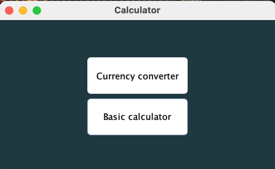
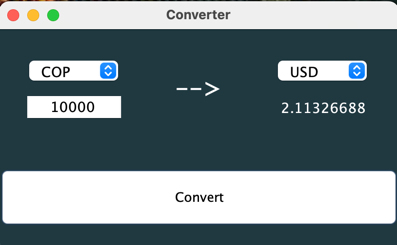
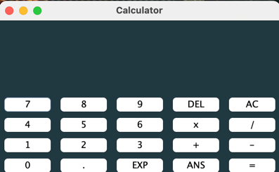

# Calculator

    

#### Challenge OracleNextEducation & Alura Latam

La calculadora dispone de un menú principal que permite acceder a las diferentes funciones creadas. Les invito a revisar las funciones de la calculadora y explorar todas las posibilidades que ofrece.

## Funciones

### Currency converter
Este aplicativo pertenece al challenge generado por el curso y su función es convertir el valor de diversas monedas. A continuación, se detallan las monedas disponibles junto con su código correspondiente:

- USD: Dólar estadounidense.
- EUR: Euro.
- GBP: Libra esterlina británica.
- JPY: Yen japonés.
- KRW: Won surcoreano.
- COP: Peso colombiano.

### Basic calculator

Este aplicativo es una calculadora que cuenta con las funciones básicas para realizar operaciones matemáticas fundamentales.

## Tecnologias

- Java

## Sobre mi

`Visitar mi portafolio web`: <https://krlozmedina.com>

